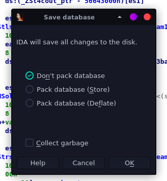

# IDA

Cheatsheet from [Joxean Koret video](https://www.youtube.com/watch?v=CQuBH6bBpYU)

* 2 versions:
  * IDA (Open 32 bits binaries)
  * IDA64 (Open 64 bits binaries)

* At the beggining IDA show us file format IDA has detected

    * Binary file (forget what you have detected i'm going to manually set what file is)

* Automatically processor type

* Load symbol filename?
  * Yes

* We have to wait until the button change to green (ready)
    * Yellow button indicates it's thinking
  

Now we can begin to play!

* With the `Space key` we can change from plain dissassembly to graph
    * From this view

    * To this view
    

* `Esc` key to return
    * If you go to a function and then to another one

* `Ctrl + Enter` key to go forward

* `g` key Go to

* You can:
  * Insert `AttachProces` (name function)
  * Insert `0x633921E3` (memory address)

* Rename something
  * `n` key

* Also you can rename variables and __labels__!

* Undo `Ctrl+z`

* Highlight variables, cursor above variable

* Gray part: datos, texto numero
* Blue: Code asociated to a function
* Red: Code non asocaited to a function 

* `u` key
  * Undefine a function

* `c` key
    * Create code

* `p` key
  * Create function (procedure)

* Don't pack database
  * Don't save anything
* Pack database (Store)
  * Compress y save compressed .idb o .i64
* Pack database (Deflate)
  * When you want to open is slowler